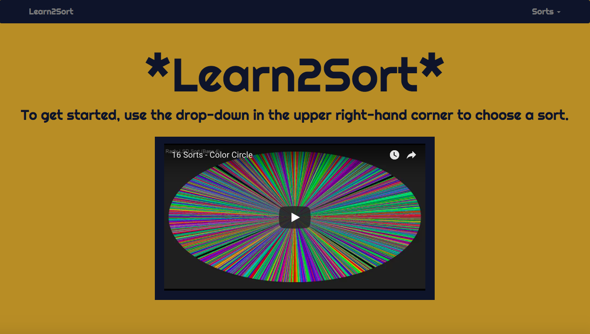
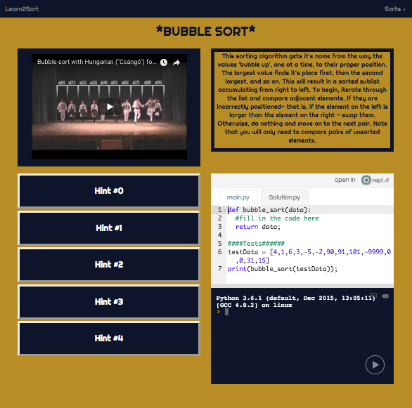

# Learn2Sort

[Try it live on heroku!](https://learn2sort.herokuapp.com/)

### The Why
This app is designed to be a clean, easy to follow resource for learning to write sorting algorithms in Python. I built this app for my Project 4 of the Web Development Immersive at General Assembly Seattle (WDI-16, 11/27/2017 - 02/23/2018). I was tired of looking at at the cluttered, overwhelming sorting web pages that I came across while studying these algorithms. Additionally, I enjoy writing alorithms and will never turn down an excuse to write one (or many) up!

### Technologies and Inspiration
  * This front-end-only project was bootstrapped with [Create React App](https://github.com/facebookincubator/create-react-app). 
  * Navigation bar and grid layout from [React-Bootstrap](https://github.com/facebookincubator/create-react-app).
  * Embeded python interpreters from [Repl.it](https://repl.it).
  * Font is [Righteous](https://fonts.google.com/specimen/Righteous) from Google Fonts.
  * Used [HTML Color Codes](https://html-color-codes.info/colors-from-image/) and a screenshot of repl.it to find hex code for the dark repl blue.
  * Dancing sort videos by [AlgoRythmics](https://www.youtube.com/channel/UCIqiLefbVHsOAXDAxQJH7Xw).
  * Referenced this [codepen](https://codepen.io/mattgreenberg/pen/ggOpOr?editors=0010) for best way to get flash-card effect on hints.
  * Color sort on home page by [w0rthy](https://www.youtube.com/channel/UCiXjgnIzKxv-93LJ9OrLU_g).

### Further Work To Be Done
  * Add several more sorts!
  * Get a UX Designer's feedback and refine styles.
  * Add Big O quiz.

### Home Page

### Example Page
